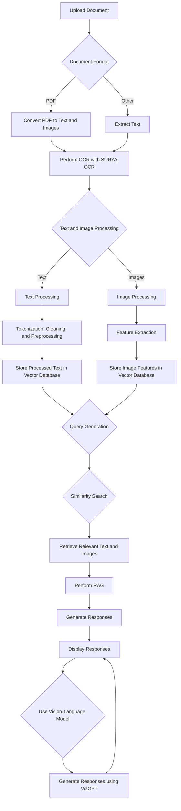

## Vision-Augmented Retrieval and Generation (VARAG)

**Introduction:**

Vision-Augmented Retrieval and Generation (VARAG) is an innovative approach that enhances conventional Retrieval-Augmented Generation (RAG) systems by incorporating both textual and visual information. Traditional RAG systems primarily rely on textual data, potentially missing out on valuable information present in diagrams, flowcharts, and images. VARAG combines RAG with Vision-Language models to understand and process both text and images effectively.

This project aims to develop a comprehensive pipeline that enables VARAG to handle text-heavy documents such as PDFs, textbooks, and research papers. By leveraging Vision-Language models, the system can extract, understand, and interact with textual and visual content seamlessly, facilitating tasks like question answering, summarization, and visual chat interfaces.

**Features:**

1. **Text and Image Processing Pipeline:** 
    - Convert PDF pages to images for processing.
    - Perform feature extraction from images using tools like Surya or Marker.
    - Utilize GPT-4 Vision with relevant prompts for understanding textual and visual content.

2. **Fine-tuning with Vision-Language Models:**
    - Prepare datasets consisting of image-caption pairs, features, questions, and answers.
    - Fine-tune models like IDEFICS, LLaVA, and Moondream for instruction understanding and question answering.
    - Optimize finetuning scripts for efficient training.

3. **Evaluation and Benchmarking:**
    - Evaluate the performance of the fine-tuned models using benchmarks such as ST-VQA, OCR-VQA, TextVQA, and DocVQA.
    - Generate visual representations of evaluation results for analysis.

4. **Visual Chat Application:**
    - Develop a visual chat interface integrated with PDFs.
    - Utilize CLIP for image encoding and select models from MTEB leaderboard for textual embedding.
    - Implement a simple RAG pipeline to retrieve relevant text and images from the database.
    - Incorporate in-context learning for enhanced user experience.

**Use Case:**

One of the primary use cases of VARAG is interacting with uploaded PDF or document files. Users can upload documents, engage in conversations, ask questions, and receive responses enriched with both textual and visual information. This feature enhances document exploration, comprehension, and collaboration by leveraging the combined power of text and images.

**Getting Started:**

To begin using VARAG, follow these steps:
1. Initialize the notebook and install relevant libraries and repositories.
2. Convert PDF pages to images and perform feature extraction.
3. Design well-crafted prompts for Vision API and iterate over images to generate question-answer pairs.
4. Fine-tune models with the prepared dataset and set up inference/generation scripts.
5. Evaluate model performance using benchmark datasets and visualize evaluation results.
6. Develop the visual chat application integrating PDFs and deploy it for interactive usage.

### Approach:

Our approach involves a multi-stage methodology to iteratively refine the vision model's understanding of text-intensive images. Starting with a base language model and integrating an image embedding model, we employ an adapter mechanism to align the language model for improved comprehension of image data. Fine-tuning is then performed using instructional-oriented image data, specifically focusing on text recognition and enabling image-text interaction. Evaluations are conducted using both existing benchmarks and custom metrics to measure the accuracy and effectiveness of the model.

### Stages:

1. **Dataset Preprocessing:**
    - Convert PDF documents into image format.
    - Utilize GPT-4 Vision API to extract information from images.
    - Prepare the dataset to train the vision model on text-heavy content.
    
    Procedure
    
    - **Step 1: ArXiv Paper Source Files**. In this step, you need to obtain the source files of scientific papers from arXiv, which is a repository of preprints in various fields of science and mathematics. You can use the arXiv API to download the source files in LaTeX format.
    - **Step 2: Paper Filtering**. In this step, you need to filter out the papers that are not relevant or suitable for your project. You can use some criteria such as the paper title, abstract, keywords, or categories to select the papers that contain text-heavy content, such as figures, tables, equations, or diagrams.
    - **Step 3: Figure-Caption Pair Extraction**. In this step, you need to extract the figure-caption pairs from the selected papers. You can use some tools or libraries such as pdfminer, pdftotext, or PyPDF2 to parse the PDF files and locate the figures and their captions. You can also use some heuristics or regular expressions to identify the figure labels and references in the LaTeX files.
    - **Step 4: Rule-based Cleaning**. In this step, you need to clean or refine the extracted figure-caption pairs using some rules or filters. You can remove the pairs that are incomplete, duplicated, or corrupted. You can also normalize the captions by removing the figure labels, references, or citations. You can also check the quality and resolution of the figures and ensure they are clear and legible.
    - **Step 5: GPT-4 Vision Prompting**. In this step, you need to use the cleaned figure-caption pairs as prompts for GPT-4 Vision, which is a large vision language model that can generate natural language based on visual inputs. You can use the format shown in the image to create answerable multiple-choice questions based on the figures. You can also provide the correct answer choice and the rationale for the correct answer.
        
        
        
        
        
        
        
2. **Fine-Tuning:**
    - Implement Lora fine-tuning to enhance the model’s performance. [Lora is a technique that reduces the number of parameters to update during fine-tuning by approximating the original weight matrix with two smaller matrices1](https://www.databricks.com/blog/efficient-fine-tuning-lora-guide-llms)[2](https://medium.com/data-science-in-your-pocket/lora-for-fine-tuning-llms-explained-with-codes-and-example-62a7ac5a3578). [This can speed up the training process and avoid catastrophic forgetting, which is the loss of knowledge from the pre-trained model1](https://www.databricks.com/blog/efficient-fine-tuning-lora-guide-llms)[2](https://medium.com/data-science-in-your-pocket/lora-for-fine-tuning-llms-explained-with-codes-and-example-62a7ac5a3578).
    - Train the model on instructional-oriented image data to improve text recognition and image-text interaction. [Instructional-oriented image data are images that contain text instructions or captions that describe the visual content or guide the user to perform certain tasks](https://www.databricks.com/blog/efficient-fine-tuning-lora-guide-llms)[3](https://github.com/yaodongC/awesome-instruction-dataset). For example, images of recipes, product manuals, or scientific figures. [Training the model on such data can help it learn to generate, understand, and follow text instructions based on visual inputs](https://www.databricks.com/blog/efficient-fine-tuning-lora-guide-llms)[3](https://github.com/yaodongC/awesome-instruction-dataset).
3. **Evaluation:**
    - Assess the model’s performance using existing benchmarks for image and text tasks. Existing benchmarks are datasets and metrics that are commonly used to evaluate the quality and accuracy of text-to-image models. [For example, HRS-Bench is a holistic, reliable, and scalable benchmark that measures 13 skills of text-to-image models across 50 scenarios](https://www.databricks.com/blog/efficient-fine-tuning-lora-guide-llms)[4](https://arxiv.org/abs/2304.05390). [COCO-Text is a dataset and benchmark for text detection and recognition in natural images](https://www.databricks.com/blog/efficient-fine-tuning-lora-guide-llms)[5](https://paperswithcode.com/paper/coco-text-dataset-and-benchmark-for-text).
    - Develop a custom benchmark to evaluate the model’s proficiency in understanding and interacting with text-heavy images. [Text-heavy images are images that contain a large amount of text or complex text structures, such as tables, charts, graphs, or diagrams](https://www.databricks.com/blog/efficient-fine-tuning-lora-guide-llms)[6](https://blog.segmind.com/beginners-guide-lora-fine-tuning/). A custom benchmark can be designed to test the model’s ability to generate, interpret, and answer questions based on text-heavy images. [For example, using the format of GPT-4 Vision Prompting](https://www.databricks.com/blog/efficient-fine-tuning-lora-guide-llms)[6](https://blog.segmind.com/beginners-guide-lora-fine-tuning/), which provides multiple-choice questions and answers based on scientific figures.

**Contributing:**

Contributions to VARAG are welcome! Whether it's code improvements, bug fixes, or feature enhancements, feel free to contribute to the project repository. Please follow the contribution guidelines outlined in the repository for smooth collaboration.

**License:**

VARAG is licensed under the [MIT License](https://opensource.org/licenses/MIT). You are free to use, modify, and distribute the code as per the terms of the license.

**Acknowledgments:**

We would like to express our gratitude to the developers of Surya, Marker, GPT-4 Vision, and various other tools and libraries that have contributed to the success of this project. Additionally, we appreciate the support of the open-source community and the valuable feedback from users during the development process.
