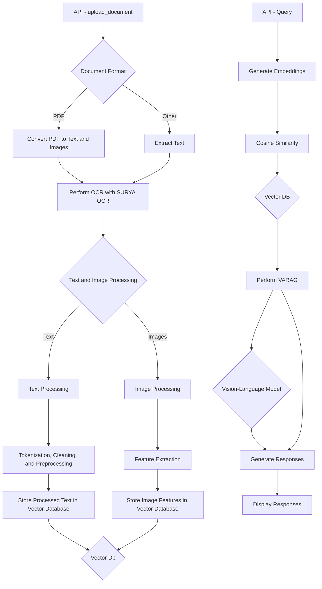

# 👁️👁️VARAG (Vision Augmented Retrival and Generation)

| | Vision-Augmented Retrieval and Generation (VARAG) is an innovative approach that enhances conventional Retrieval-Augmented Generation (RAG) systems by incorporating both textual and visual information. Traditional RAG systems primarily rely on textual data, potentially missing out on valuable information present in diagrams, flowcharts, and images. VARAG combines RAG with Vision-Language models to understand and process both text and images effectively. |
|:--:|:--|

## **🚀 Getting Started with VARAG**

Ready to dive into VARAG? Follow these detailed steps to get started:

### **1. Clone the Repository**

```bash
git clone https://github.com/adithya-s-k/VARAG
cd VARAG
```

### **2. Set Up Environment**

Create and activate a virtual environment using Conda:

```bash
conda create -n varag-venv python=3.10
conda activate varag-venv
```

### **3. Install Dependencies**

Install the required packages using pip:

```bash
pip install -e .
pip install -r requirements.txt
```

### **4. Run the Server**

Start the VARAG server:

```bash
python main.py
```

### **5. Alternatively, Use Docker**

If you prefer Docker, run:

```bash
docker-compose up
```

With these steps, you're all set to explore the capabilities of VARAG and its advanced features!

## **📚 Use Case**

VARAG shines in interacting with uploaded PDF or document files. Users can upload documents, engage in conversations, ask questions, and receive responses enriched with both textual and visual information. This feature enhances document exploration, comprehension, and collaboration by leveraging the combined power of text and images.

## What Happens on the Inside


## **🛠️ Contributing**

Contributions to VARAG are highly encouraged! Whether it's code improvements, bug fixes, or feature enhancements, feel free to contribute to the project repository. Please adhere to the contribution guidelines outlined in the repository for smooth collaboration.

## **📜 License**

VARAG is licensed under the [MIT License](https://opensource.org/licenses/MIT), granting you the freedom to use, modify, and distribute the code in accordance with the terms of the license.

## **🙏 Acknowledgments**

We extend our sincere appreciation to the developers of Surya, Marker, GPT-4 Vision, and various other tools and libraries that have played pivotal roles in the success of this project. Additionally, we are grateful for the support of the open-source community and the invaluable feedback from users during the development journey.

